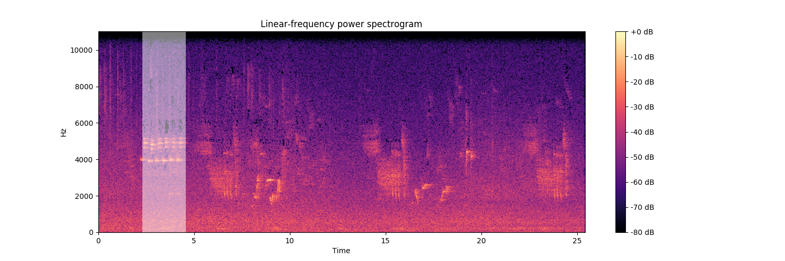

# Audio event detection
Work conducted during an internship at IRCAM. <br/> <br/>
<div align="left">
  <br><br>
</div>

## Disclaimer
This code is no longer actively maintained. The algorithms implemented in this library 
were only tested on toy examples and did not yield satisfying performances on most experiments. 
Audio files in the examples/data folder seem corrupted, and example scripts can therefore no longer 
be ran.

## `pip` installation 
Run the following command :

```
pip install -e git+https://github.com/rpetit/audio-event-detection#egg=evdetect
```

## Example

Detection of a bird's song with a hidden Markov model. <br/>

From the examples directory, run bird.py to get the following output :



This will also output a .wav file in examples/results where only the segments matching the event model 
have been preserved. </br>

See [this page](https://rpetit.github.io/audio-event-detection) for more examples.

## References
[1] A. Bietti, online learning for audio clustering and segmentation Master thesis, 2014 <br/><br/>
[2] A. Cont, a coupled duration-focused architecture for realtime music to score alignment, IEEE Transactions on Pattern 
Analysis and Machine Intelligence, 2010 <br/><br/>
[3] Y. Matsubara, Y. Sakurai, N. Ueda and M. Yoshikawa, fast and exact monitoring of co-evolving data streams, IEEE 
International Conference on Data Mining, 2014 <br/><br/>
[4] L. Rabiner, a tutorial on hidden Markov models and selected applications in speech recognition, Proceedings of the 
IEEE, 1989
